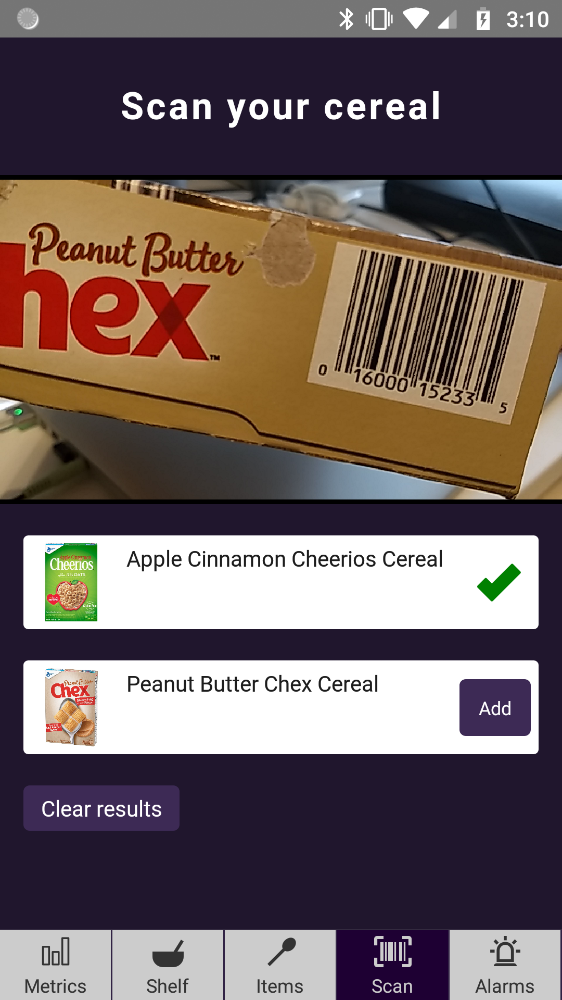
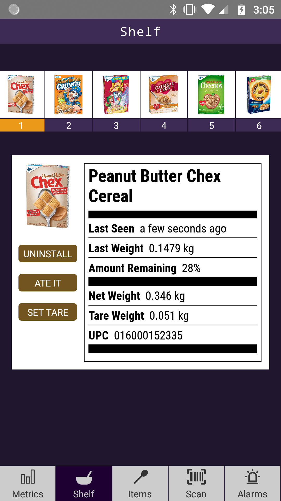
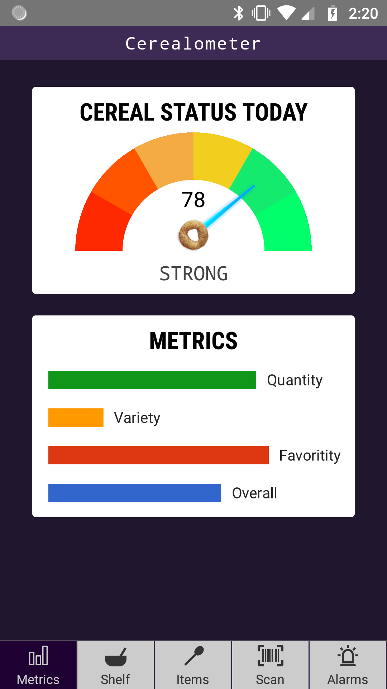
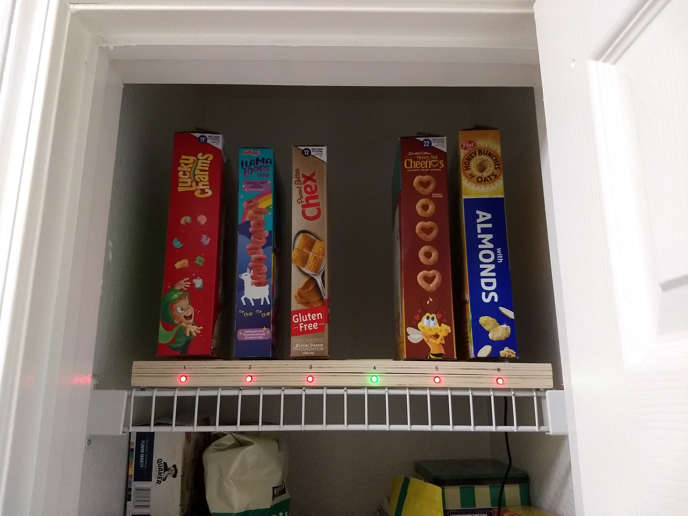
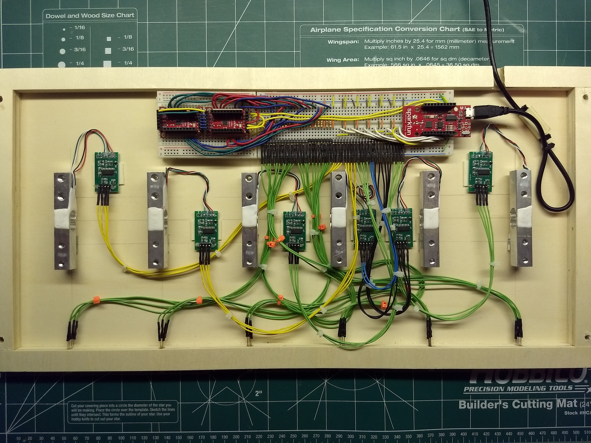
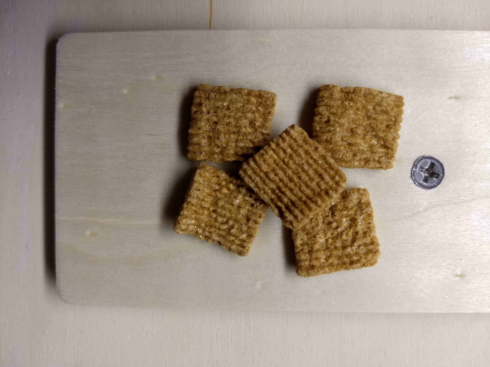

  Introducing...
   
  
  
Think Inside the Box.

Fires. Floods. Famine. A whole lot of F. We live in uncertain times. But one thing is certain: you've gotta start the day (or at least end it) with a good breakfast. So when you open the cupboard and find yourself facing the same set of uninspiring, unsatisfying, unsweetened cereals — or worse, none at all — it's time to ask yourself, “HOW DID I LET THIS HAPPEN?!”	

You are not alone. Every day, dozens of people the world over encounter this dreadful disappointment. And of those dozens, a small subset reflects upon this further and at least THREE of them definitely wish it didn't have to be this way. Well, it doesn't.

## Okay, okay! What is it?
Cerealometer is a realtime breakfast cereal monitoring solution designed to ensure uninterrupted delivery of your essential daily vitamins, minerals, yellow moons, green clovers, and so on. Inspired by my cereal-crazy nephews, Cerealometer combines IoT technology and kitchen cabinetry to produce, well, a fun, strange combination of IoT technology and kitchen cabinetry.

## What does it do?

  
  
  
   
  Screenshots from the app, which makes use of Google Firebase, Mobile Vision API, and more.

The Cerealometer app...
* Scans your cereal, grocery checkout-style. It even makes the "be-BOOP"!
* Tracks remaining quantity and other important cereal metrics.
* Sends alerts when quantity or variety become dangerously low.
* Manages users and item inventory via the cloud (☁️).

By now you must be asking, HOW DOES IT KNOW how much cereal I have left?

## Weight Weight... Don't Tell Me!

 
The Shelf and its innards

The app communicates with a [DIY IoT device](https://github.com/ahtraddis/cerealometer-hardware) I like to call the Shelf, for reasons that will become obvious once you see that... it's a shelf.
At the heart of the circuitry is a nicely-groomed nest of breadboard wires. Oh, and also the [SparkFun ESP8266 Thing Dev Board](https://www.sparkfun.com/products/13711). Load cells inside the Shelf track the net weight of each cereal box*, and the WiFi-connected microcontroller uploads this vital data to the cloud. Also, a dazzling LED display communicates status for each, uh, cereal port.

*Accurate to within about five grahams

## What's it all for?
In addition to addressing a problem of great social and political import, Cerealometer is a learning project I created to expand my knowledge in a handful of technical areas. Basically, my current dev bucketlist:
* IoT and the mighty [ESP8266](https://en.wikipedia.org/wiki/ESP8266) microcontroller
* Embedded firmware using [ESP8266 Arduino Core](https://github.com/esp8266/Arduino)
* [React Native](https://facebook.github.io/react-native/) and Infinite Red's [Ignite Bowser](https://github.com/infinitered/ignite-bowser) boilerplate
* [MobX State Tree](https://mobx-state-tree.js.org/intro/philosophy)
* [Hooks](https://reactjs.org/docs/hooks-intro.html)
* [TypeScript](https://www.typescriptlang.org/index.html)
* [ECMAScript 6](http://es6-features.org/), arrow functions, promises... oh my! 
* [Google Firebase](https://firebase.google.com/) and [Cloud Functions](https://cloud.google.com/functions)
* NoSQL database approach (Firebase [Realtime Database](https://firebase.google.com/docs/database) in this case)

I share it as an evolving example of a full stack, serverless IoT system which I hope will inspire your own project.

## License

This project is licensed under the MIT License - see the [LICENSE](LICENSE) file for details.

## About the author
Eric Schwartz is a self-described cereal entrepreneur who enjoys cereal, entrepreneuring, and describing himself in the third person. Write to him at eric@cerealometer.com for the address to which you should send all of your money.